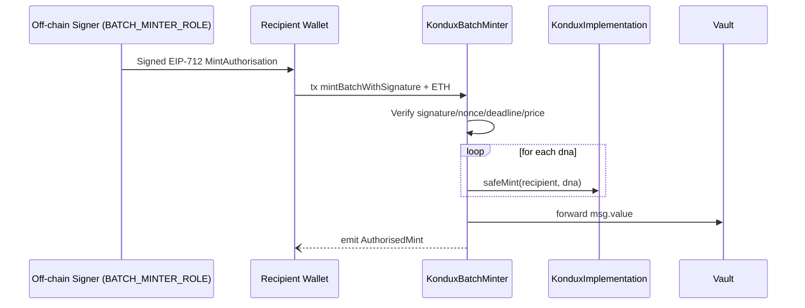

# Executive Summary of **KonduxBatchMinter**

## Table of Contents

- [Executive Summary of **KonduxBatchMinter**](#executivesummary-of-konduxbatchminter)
  - [Table of Contents](#table-of-contents)
  - [Introduction](#introduction)
  - [Deep‑Dive: EIP‑712 Batch‑Mint Workflow](#deepdive-eip712-batchmint-workflow)
  - [End‑to‑End JavaScript Tutorial](#endtoend-javascript-tutorial)
    - [1. Install](#1-install)
    - [2. Boilerplate](#2-boilerplate)
    - [3. Build the **typed‑data domain** \& types object](#3-build-the-typeddata-domain--typesobject)
    - [4. Craft the mint payload](#4-craft-the-mint-payload)
    - [5. Sign the **typed data**](#5-sign-the-typed-data)
    - [6. Submit the transaction](#6-submit-the-transaction)
    - [7. Post‑mint checks (optional)](#7-postmint-checks-optional)
    - [How the Solidity ⟷ JS Pieces Fit Together](#how-the-solidityjs-pieces-fittogether)
    - [Production Tips \& Pitfalls](#production-tips--pitfalls)
  - [Batch‑Mint Limits \& Cost Scaling](#batchmint-limits--cost-scaling)
    - [1 · What ultimately caps a batch?](#1--what-ultimately-caps-a-batch)
    - [2 · Gas‑cost grows almost linearly](#2--gascost-grows-almost-linearly)
    - [3 · Best‑practice checklist](#3--bestpractice-checklist)

## Introduction

The **KonduxBatchMinter** contract is an **off‑chain–authorised, on‑chain‑verified helper** that lets a privileged signer mint multiple Kondux NFTs (kNFTs) for any user in **one transaction** and automatically routes the ETH payment to a protocol vault.

| Core element          | Details                                                                                                                                                                                                                                       |
| --------------------- | --------------------------------------------------------------------------------------------------------------------------------------------------------------------------------------------------------------------------------------------- |
| **Roles**             | *`BATCH_MINTER_ROLE`* (local to this contract) – any EOA or contract holding this role can issue off‑chain EIP‑712 signatures that authorise a batch mint.                                                                                    |
| **Immutable links**   | `kondux` (IKondux) – points to a KonduxImplementation proxy<br>`authority` – exposes a single `vault()` address where funds are forwarded.                                                                                                    |
| **Replay protection** | `mintNonces[recipient]` – monotonically increasing nonce scoped **per recipient**; burned after each successful mint to make signatures single‑use.                                                                                           |
| **EIP‑712 spec**      | Domain: `name = "Kondux kNFT", version = "1", chainId, verifyingContract`<br>Primary type: `MintAuthorisation` with fields *(recipient, dnasHash, nonce, deadline, priceWei)*.                                                                |
| **Economic flow**     | 1 . User (or dApp) sends signed payload + ETH to `mintBatchWithSignature` → 2 . Contract mints each DNA to `recipient` through `kondux.safeMint` → 3 . Full `msg.value` is forwarded to `authority.vault()` with `sendValue`.                 |
| **Security gates**    | ‑ Signature must be valid and come from a *current* `BATCH_MINTER_ROLE` holder.<br>‑ Deadline must be in the future.<br>‑ Nonce must match stored value.<br>‑ Price must equal `msg.value`.<br>‑ Reentrancy is blocked via `ReentrancyGuard`. |

**Why separate minter?**

* Drastically reduces gas for users by batching up to *N* mints behind one ECDSA check.
* Allows server‑side or mobile‑signed coupons, let alone fiat/credit‑card checkouts, while preserving full on‑chain trustlessness.
* Centralises ETH accounting: the Kondux treasury or DAO need track only the vault balance.

---

## Deep‑Dive: EIP‑712 Batch‑Mint Workflow

Below is the life‑cycle from **off‑chain voucher creation** to **on‑chain mint**.



1. **Batch signer** (backend, cold wallet, or DAO multisig) builds the `MintAuthorisation` struct, hashes the DNA array, signs via EIP‑712.
2. **User (or relayer)** submits signature, parameters, and ETH to `mintBatchWithSignature`.
3. Contract verifies signature & nonce, mints all requested DNAs to recipient, then…
4. Forwards *all* ETH to the vault in the same call (no custody).

---

## End‑to‑End JavaScript Tutorial

*Using **ethers v6** and Node.js. Adjust for v5 if needed.*

### 1. Install

```bash
npm install ethers@^6 dotenv
```

### 2. Boilerplate

```js
import { Wallet, JsonRpcProvider, keccak256, toUtf8Bytes } from "ethers";
import dotenv from "dotenv";

dotenv.config();
const provider = new JsonRpcProvider(process.env.RPC_URL);
const chainId  = await provider.getNetwork().then(n => n.chainId);

// ── Addresses ─────────────────────────────────────────────
const KONDUX_MINTER = "0xBatchMinterProxy";
const KONDUX_NFT    = "0xKonduxCollection";   // the kNFT proxy you want to mint on

// ── ABIs (trimmed) ────────────────────────────────────────
const minterAbi = [
  "function mintNonces(address) view returns (uint256)",
  "function mintBatchWithSignature(address,uint256[],uint256,uint256,uint256,bytes)"
];
const konduxAbi = [ "function safeMint(address,uint256) returns (uint256)" ];

// ── Signer roles ──────────────────────────────────────────
const signer      = new Wallet(process.env.SIGNER_PK, provider);      // has BATCH_MINTER_ROLE
const userWallet  = new Wallet(process.env.USER_PK, provider);        // recipient / msg.sender
```

### 3. Build the **typed‑data domain** & types object

```js
const domain = {
  name: "Kondux kNFT",
  version: "1",
  chainId,
  verifyingContract: KONDUX_MINTER
};

const types = {
  MintAuthorisation: [
    { name: "recipient", type: "address" },
    { name: "dnasHash", type: "bytes32" },
    { name: "nonce", type: "uint256" },
    { name: "deadline", type: "uint256" },
    { name: "priceWei", type: "uint256" }
  ]
};
```

### 4. Craft the mint payload

```js
// pick your DNA values (uint256 each)
const dnas      = [
  0x000102030405060708090a0b0c0d0e0f101112131415161718191a1b1c1d1e1f,
  0xaaaaaaaaaaaaaaaaaaaaaaaaaaaaaaaaaaaaaaaaaaaaaaaaaaaaaaaaaaaaaaaa
];

const priceWei  = ethers.parseEther("0.05");          // total ETH expected
const deadline  = Math.floor(Date.now() / 1e3) + 3600; // 1‑hour validity

// fetch current nonce from the contract
const minter = new ethers.Contract(KONDUX_MINTER, minterAbi, provider);
const nonce  = await minter.mintNonces(userWallet.address);

// hash the DNA array exactly like the solidity code
const dnasHash = keccak256(ethers.solidityPacked(["uint256[]"], [dnas]));
```

### 5. Sign the **typed data**

```js
const value = { recipient: userWallet.address, dnasHash, nonce, deadline, priceWei };

const signature = await signer.signTypedData(domain, types, value);
console.log("Signature:", signature);
```

The resulting signature encodes `(v, r, s)` that Solidity verifies with:

```solidity
address signer = ECDSA.recover(digest, signature);
```

### 6. Submit the transaction

```js
// connect the USER wallet (they pay gas & ETH priceWei)
const tx = await minter
  .connect(userWallet)
  .mintBatchWithSignature(
      userWallet.address, // recipient
      dnas,
      deadline,
      priceWei,
      nonce,
      signature,
      { value: priceWei }  // msg.value
  );

console.log("Mint submitted:", tx.hash);
await tx.wait();
console.log("Mint confirmed!");
```

### 7. Post‑mint checks (optional)

```js
const kNFT = new ethers.Contract(KONDUX_NFT, konduxAbi, provider);
const newSupply = await kNFT.totalSupply();
console.log("Collection supply is now:", newSupply.toString());
```

---

### How the Solidity ⟷ JS Pieces Fit Together

| Step | JavaScript action                                           | Solidity counterpart                                                                       |
| ---- | ----------------------------------------------------------- | ------------------------------------------------------------------------------------------ |
| 1    | Build `domain`, `types`, `value`                            | `EIP712._hashTypedDataV4(...)` uses identical domain values.                               |
| 2    | Compute `dnasHash` with `keccak256(abi.encodePacked(dnas))` | Solidity `abi.encodePacked(dnas)` uses dynamic array encoding – *byte‑for‑byte identical*. |
| 3    | Sign with `signTypedData`                                   | `ECDSA.recover(digest, sig)` validates signature.                                          |
| 4    | Pass `nonce` equal to `mintNonces[recipient]`               | Contract checks `nonce == mintNonces[recipient]` then increments.                          |
| 5    | Provide exact `priceWei` in both params **and** `msg.value` | Reverts if mismatch.                                                                       |
| 6    | Transaction mined → `_safeMint` inside KonduxImplementation | kNFT emits standard `Transfer` events.                                                     |
| 7    | ETH auto‑forwarded via `sendValue`                          | No ETH ever rests in BatchMinter, so no withdrawal surface.                                |


---

### Production Tips & Pitfalls

* **Chain‑ID drift**: Signer and contract must agree; always derive `chainId` from provider.
* **DNA ordering**: The hash depends on the **byte‑order** of your `uint256[]`; never stringify DNAs first.
* **Nonce sync**: If a signature is rejected, fetch `mintNonces` again—someone might have front‑run a mint.
* **Gas estimation**: Batch mint cost grows roughly *linear* with `dnas.length`; price your `priceWei` accordingly.
* **Cold‑wallet signing**: `signTypedData` works on Ledger / Trezor (EIP‑712 aware) for secure role keys.

---

## Batch‑Mint Limits & Cost Scaling

### 1 · What ultimately caps a batch?

`KonduxBatchMinter` places **no hard limit** on the length of the `dnas[]`
array.
The only factors that can stop a transaction are:

| Limiting factor            | Comment                                                                            |
| -------------------------- | ---------------------------------------------------------------------------------- |
| **EVM block gas limit**    | On Ethereum main‑net this is \~30 M gas.                                           |
| **Collection `maxSupply`** | Each `safeMint` enforces the cap you set during `initialize`.                      |
| **Node / RPC gas cap**     | Some providers reject transactions above a configurable threshold (e.g. 15 M gas). |

Using today’s gas report (≈ 208 k gas per `safeMint`, plus \~70 k overhead for
signature checks & vault transfer):

```
practicalMax = floor( (blockGasLimit – 70 k) / 208 k ) ≈ 140 mints
```

You should therefore:

* **Main‑net**: keep single batches **≤ 130–140 NFTs**.
* **Layer‑2** (Optimism, Arbitrum, etc.): block gas is \~100 M → **450 + mints**
  per batch are feasible.
* **Large drops**: split into sequential batches; the nonce mechanism already
  guards against replay.

---

### 2 · Gas‑cost grows almost linearly

| Component                                                  | Gas (approx.) |
| ---------------------------------------------------------- | ------------: |
| Base overhead (EIP‑712 verify, loop setup, vault transfer) |  **\~70 000** |
| **Each additional `safeMint`**                             | **\~208 000** |

Total gas ≈ 70 k + *208 k × batchSize*

That means:

*Doubling the batch size \~doubles the gas*, with only a tiny fixed surcharge.
Consequently, the **ETH fee per NFT** **decreases** slightly in larger batches
because that 70 k overhead is amortised.

| Batch size | Total gas | Gas / NFT | ETH @ 30 gwei |
| ---------- | --------: | --------: | ------------: |
| 1          |     278 k |     278 k |    0.0083 ETH |
| 10         |    2.15 M |     215 k |     0.064 ETH |
| 50         |    10.5 M |     210 k |     0.314 ETH |
| 130        |    27.0 M |     208 k |     0.810 ETH |

*(Gas numbers rounded; assumes block gas = 30 M and 1 ETH = US\$3 500.)*

---

### 3 · Best‑practice checklist

1. **Pre‑compute** how many NFTs fit on your target chain/block.
2. **Group mints** into the largest batch that safely fits to lower per‑NFT
   gas.
3. For drops > block limit, **issue multiple signatures** (incrementing the
   nonce) and let users execute them back‑to‑back.
4. Always keep an eye on `maxSupply`: the loop stops the whole batch if a
   single mint would overflow.

