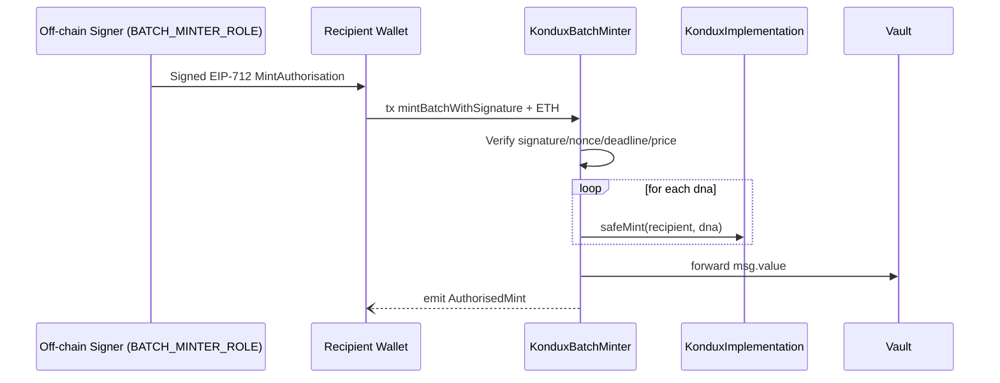

# Executive Summary of **KonduxBatchMinter**

## Table of Contents

- [Executive Summary of **KonduxBatchMinter**](#executivesummary-of-konduxbatchminter)
  - [Table of Contents](#table-of-contents)
  - [Introduction](#introduction)
  - [Deep‑Dive: EIP‑712 Batch‑Mint Workflow](#deepdive-eip712-batchmint-workflow)
    - [Full example](#full-example)
      - [Backend](#backend)
      - [Client](#client)
      - [Code Example](#code-example)
    - [How the Solidity ⟷ JS Pieces Fit Together](#how-the-solidityjs-pieces-fittogether)
    - [Production Tips \& Pitfalls](#production-tips--pitfalls)
  - [Batch‑Mint Limits \& Cost Scaling](#batchmint-limits--cost-scaling)
    - [1 · What ultimately caps a batch?](#1--what-ultimately-caps-a-batch)
    - [2 · Gas‑cost grows almost linearly](#2--gascost-grows-almost-linearly)
    - [3 · Best‑practice checklist](#3--bestpractice-checklist)

## Introduction

The **KonduxBatchMinter** contract is an **off‑chain–authorised, on‑chain‑verified helper** that lets a privileged signer mint multiple Kondux NFTs (kNFTs) for any user in **one transaction** and automatically routes the ETH payment to a protocol vault.

| Core element          | Details                                                                                                                                                                                                                                       |
| --------------------- | --------------------------------------------------------------------------------------------------------------------------------------------------------------------------------------------------------------------------------------------- |
| **Roles**             | *`BATCH_MINTER_ROLE`* (local to this contract) – any EOA or contract holding this role can issue off‑chain EIP‑712 signatures that authorise a batch mint.                                                                                    |
| **Immutable links**   | `kondux` (IKondux) – points to a KonduxImplementation proxy<br>`authority` – exposes a single `vault()` address where funds are forwarded.                                                                                                    |
| **Replay protection** | `mintNonces[recipient]` – monotonically increasing nonce scoped **per recipient**; burned after each successful mint to make signatures single‑use.                                                                                           |
| **EIP‑712 spec**      | Domain: `name = "Kondux kNFT", version = "1", chainId, verifyingContract`<br>Primary type: `MintAuthorisation` with fields *(recipient, dnasHash, nonce, deadline, priceWei)*.                                                                |
| **Economic flow**     | 1 . User (or dApp) sends signed payload + ETH to `mintBatchWithSignature` → 2 . Contract mints each DNA to `recipient` through `kondux.safeMint` → 3 . Full `msg.value` is forwarded to `authority.vault()` with `sendValue`.                 |
| **Security gates**    | ‑ Signature must be valid and come from a *current* `BATCH_MINTER_ROLE` holder.<br>‑ Deadline must be in the future.<br>‑ Nonce must match stored value.<br>‑ Price must equal `msg.value`.<br>‑ Reentrancy is blocked via `ReentrancyGuard`. |

**Why separate minter?**

* Drastically reduces gas for users by batching up to *N* mints behind one ECDSA check.
* Allows server‑side or mobile‑signed coupons, let alone fiat/credit‑card checkouts, while preserving full on‑chain trustlessness.
* Centralises ETH accounting: the Kondux treasury or DAO need track only the vault balance.

---

## Deep‑Dive: EIP‑712 Batch‑Mint Workflow

Below is the life‑cycle from **off‑chain voucher creation** to **on‑chain mint**.



1. **Batch signer** (backend, cold wallet, or DAO multisig) builds the `MintAuthorisation` struct, hashes the DNA array, signs via EIP‑712.
2. **User (or relayer)** submits signature, parameters, and ETH to `mintBatchWithSignature`.
3. Contract verifies signature & nonce, mints all requested DNAs to recipient, then…
4. Forwards *all* ETH to the vault in the same call (no custody).

---

### Full example

Here’s a complete example of how to use the `KonduxBatchMinter` in a typical minting flow:

#### Backend
It checks whether the user’s address is eligible and calls `generateMintVoucher`, which does the following:

* Reads the user’s current nonce (`mintNonces`) from the contract to prevent replay attacks.
* Sets an expiration time (`deadline`) for the authorization.
* Computes `dnasHash` by concatenating and hashing the provided DNAs.
* Builds the EIP‑712 domain with the same settings as the contract (name “Kondux kNFT” and version “1”).
* Signs the `MintAuthorisation` structure with the backend’s private key, producing the EIP‑712 signature.
* Returns a `voucher` object containing all those data fields and the signature.

#### Client
On receiving the voucher, it calls `mintWithVoucher` with its own private key.

* The function instantiates a `minterContract` pointing to `KonduxBatchMinter`.
* It uses `mintBatchWithSignature` to submit the batch mint, passing the DNAs, deadline, nonce, price and signature.
* It attaches `priceWei` as `value` in the transaction request to cover the cost required by the contract.
* It returns the transaction hash, indicating that the mint has been submitted.

Result: Once the transaction is confirmed, the user receives their NFTs in a single mint batch and can verify the returned transaction hash.

#### Code Example

Prerequisites:

- Node.js installed (version 14.x or later)
- Install the necessary dependencies:

```bash
npm install ethers dotenv
```

```typescript
import { ethers } from "ethers";

// Configuration: define network RPC and the deployed KonduxBatchMinter address.
// Replace the mainnet address when available.
const NETWORKS = {
  sepolia: {
    rpc: "https://rpc.sepolia.org",
    batchMinterAddress: "0x43EA065138D2Cc9678976cDd29Dad707579c8a65",
  },
  mainnet: {
    rpc: "https://mainnet.infura.io/v3/YOUR_INFURA_PROJECT_ID",
    batchMinterAddress: "TBD_CONTRACT_ADDRESS", // Replace with actual when deployed
  },
};

// Define the shape of a mint voucher that will be signed off‑chain by the backend.
interface MintVoucher {
  recipient: string;
  dnas: bigint[];
  priceWei: bigint;
  nonce: bigint;
  deadline: bigint;
  signature: string;
}

/**
 * Backend service: generate an EIP‑712 signed voucher for batch minting.
 *
 * This function encapsulates the server-side logic that verifies user eligibility
 * (omitted here) and produces a voucher signed by the backend's private key.
 */
async function generateMintVoucher(
  networkName: keyof typeof NETWORKS,
  backendPk: string,     // Private key of backend signer (must have BATCH_MINTER_ROLE)
  recipient: string,
  dnas: bigint[],
  priceWei: bigint,
  expiresInSec: number = 3600
): Promise<MintVoucher> {
  const { rpc, batchMinterAddress } = NETWORKS[networkName];
  const provider = new ethers.JsonRpcProvider(rpc);
  const backendWallet = new ethers.Wallet(backendPk, provider);

  // Minimal ABI to interact with the contract and read the nonce
  const abi = ["function mintNonces(address) view returns (uint256)"];
  const minterContract = new ethers.Contract(batchMinterAddress, abi, provider);

  // Query the current nonce for the recipient to avoid replay attacks
  const nonce: bigint = await minterContract.mintNonces(recipient);

  // Compute a deadline timestamp for the voucher (e.g. 1 hour from now)
  const deadline: bigint = BigInt(Math.floor(Date.now() / 1000) + expiresInSec);

  // Compute dnasHash by concatenating 32‑byte encodings of each DNA value
  const dnaBytes = dnas.map((dna) =>
    ethers.zeroPadValue(ethers.toBeHex(dna), 32)
  );
  const dnasHash: string = ethers.keccak256(ethers.concat(dnaBytes));

  // Build EIP‑712 domain and types definitions as expected by the smart contract
  const chainId = BigInt((await provider.getNetwork()).chainId);
  const domain = {
    name: "Kondux kNFT",
    version: "1",
    chainId,
    verifyingContract: batchMinterAddress,
  };
  const types = {
    MintAuthorisation: [
      { name: "recipient", type: "address" },
      { name: "dnasHash", type: "bytes32" },
      { name: "nonce", type: "uint256" },
      { name: "deadline", type: "uint256" },
      { name: "priceWei", type: "uint256" },
    ],
  };

  // Message payload matching the MintAuthorisation struct
  const message = {
    recipient,
    dnasHash,
    nonce,
    deadline,
    priceWei,
  };

  // Sign the typed data with the backend wallet. This signature proves the voucher's authenticity.
  const signature: string = await backendWallet.signTypedData(
    domain,
    types,
    message
  );

  // Return the voucher to be used by the frontend/client
  return {
    recipient,
    dnas,
    priceWei,
    nonce,
    deadline,
    signature,
  };
}

/**
 * Client function: consume a voucher and call the smart contract to mint NFTs.
 *
 * The recipient wallet submits the transaction, attaching the required Ether.
 */
async function mintWithVoucher(
  networkName: keyof typeof NETWORKS,
  recipientPk: string,
  voucher: MintVoucher
): Promise<string> {
  const { rpc, batchMinterAddress } = NETWORKS[networkName];
  const provider = new ethers.JsonRpcProvider(rpc);
  const recipientWallet = new ethers.Wallet(recipientPk, provider);

  // ABI including the mintBatchWithSignature function
  const abi = [
    "function mintBatchWithSignature(address,uint256[],uint256,uint256,uint256,bytes) payable",
  ];
  const minterContract = new ethers.Contract(
    batchMinterAddress,
    abi,
    provider
  );

  // Submit the mint transaction, paying `priceWei` if necessary
  const tx = await minterContract
    .connect(recipientWallet)
    .mintBatchWithSignature(
      voucher.recipient,
      voucher.dnas,
      voucher.deadline,
      voucher.priceWei,
      voucher.nonce,
      voucher.signature,
      { value: voucher.priceWei }
    );

  // Wait until the transaction is confirmed on chain
  await tx.wait();
  return tx.hash;
}

// -----------------------------------------------------------------------------
// Example flow tying everything together
// -----------------------------------------------------------------------------

async function exampleFlow() {
  // 1. User calls backend service (simulated here):
  //    The backend verifies the user's address/eligibility and prepares a voucher.
  const backendPrivateKey = process.env.BACKEND_PK!;
  const userAddress = process.env.USER_ADDRESS!;
  const dnas = [1n, 2n, 3n]; // Example DNA values
  const priceWei = 0n;       // Example price; adjust as needed

  // Backend generates the signed voucher off‑chain
  const voucher = await generateMintVoucher(
    "sepolia",
    backendPrivateKey,
    userAddress,
    dnas,
    priceWei
  );

  // 2. User (client) submits voucher to the smart contract along with payment
  const userPrivateKey = process.env.USER_PK!;
  const txHash = await mintWithVoucher("sepolia", userPrivateKey, voucher);

  // 3. Confirmation: the transaction hash indicates minting was successful
  console.log("Mint transaction sent:", txHash);
}

exampleFlow().catch((error) => console.error(error));

```


---

### How the Solidity ⟷ JS Pieces Fit Together


| Step | JavaScript/TypeScript action                                                                                                             | Solidity counterpart                                                                              |
| ---- | ---------------------------------------------------------------------------------------------------------------------------------------- | ------------------------------------------------------------------------------------------------- |
| 1    | Build the EIP‑712 `domain`, `types` and `message` objects exactly as in the contract (`name`, `version`, `chainId`, `verifyingContract`) | `EIP712._hashTypedDataV4(...)` internally uses the same domain fields when hashing                |
| 2    | Compute `dnasHash` by zero-padding each DNA to 32 bytes, concatenating them and hashing with `keccak256`                                 | In Solidity `keccak256(abi.encodePacked(dnas))` concatenates dynamic array elements identically   |
| 3    | Use `signTypedData` (or `_signTypedData`) to sign the struct off‑chain                                                                   | `ECDSA.recover(digest, signature)` inside `mintBatchWithSignature` verifies the signer            |
| 4    | Query `mintNonces(recipient)` and pass that value as `nonce`                                                                             | The contract checks `nonce == mintNonces[recipient]` and then increments it to prevent replays    |
| 5    | Set `priceWei` in the typed message and send exactly that amount as `msg.value`                                                          | `mintBatchWithSignature` reverts if `msg.value` doesn’t equal the `priceWei` parameter            |
| 6    | Send the transaction; once mined, the contract calls `safeMint` for each DNA                                                             | `_safeMint` in `KonduxImplementation` mints the NFTs and emits standard `Transfer` events         |
| 7    | No Ether remains in the batch minter after minting                                                                                       | The contract forwards any ETH received to `authority.vault()` via `sendValue`, leaving no balance |

---

### Production Tips & Pitfalls

* **Chain‑ID drift**: Signer and contract must agree; always derive `chainId` from provider.
* **DNA ordering**: The hash depends on the **byte‑order** of your `uint256[]`; never stringify DNAs first.
* **Nonce sync**: If a signature is rejected, fetch `mintNonces` again—someone might have front‑run a mint.
* **Gas estimation**: Batch mint cost grows roughly *linear* with `dnas.length`; price your `priceWei` accordingly.
* **Cold‑wallet signing**: `signTypedData` works on Ledger / Trezor (EIP‑712 aware) for secure role keys.

---

## Batch‑Mint Limits & Cost Scaling

### 1 · What ultimately caps a batch?

`KonduxBatchMinter` places **no hard limit** on the length of the `dnas[]`
array.
The only factors that can stop a transaction are:

| Limiting factor            | Comment                                                                            |
| -------------------------- | ---------------------------------------------------------------------------------- |
| **EVM block gas limit**    | On Ethereum main‑net this is \~30 M gas.                                           |
| **Collection `maxSupply`** | Each `safeMint` enforces the cap you set during `initialize`.                      |
| **Node / RPC gas cap**     | Some providers reject transactions above a configurable threshold (e.g. 15 M gas). |

Using today’s gas report (≈ 208 k gas per `safeMint`, plus \~70 k overhead for
signature checks & vault transfer):

```
practicalMax = floor( (blockGasLimit – 70 k) / 208 k ) ≈ 140 mints
```

You should therefore:

* **Main‑net**: keep single batches **≤ 130–140 NFTs**.
* **Layer‑2** (Optimism, Arbitrum, etc.): block gas is \~100 M → **450 + mints**
  per batch are feasible.
* **Large drops**: split into sequential batches; the nonce mechanism already
  guards against replay.

---

### 2 · Gas‑cost grows almost linearly

| Component                                                  | Gas (approx.) |
| ---------------------------------------------------------- | ------------: |
| Base overhead (EIP‑712 verify, loop setup, vault transfer) |  **\~70 000** |
| **Each additional `safeMint`**                             | **\~208 000** |

Total gas ≈ 70 k + *208 k × batchSize*

That means:

*Doubling the batch size \~doubles the gas*, with only a tiny fixed surcharge.
Consequently, the **ETH fee per NFT** **decreases** slightly in larger batches
because that 70 k overhead is amortised.

| Batch size | Total gas | Gas / NFT | ETH @ 30 gwei |
| ---------- | --------: | --------: | ------------: |
| 1          |     278 k |     278 k |    0.0083 ETH |
| 10         |    2.15 M |     215 k |     0.064 ETH |
| 50         |    10.5 M |     210 k |     0.314 ETH |
| 130        |    27.0 M |     208 k |     0.810 ETH |

*(Gas numbers rounded; assumes block gas = 30 M and 1 ETH = US\$3 500.)*

---

### 3 · Best‑practice checklist

1. **Pre‑compute** how many NFTs fit on your target chain/block.
2. **Group mints** into the largest batch that safely fits to lower per‑NFT
   gas.
3. For drops > block limit, **issue multiple signatures** (incrementing the
   nonce) and let users execute them back‑to‑back.
4. Always keep an eye on `maxSupply`: the loop stops the whole batch if a
   single mint would overflow.

