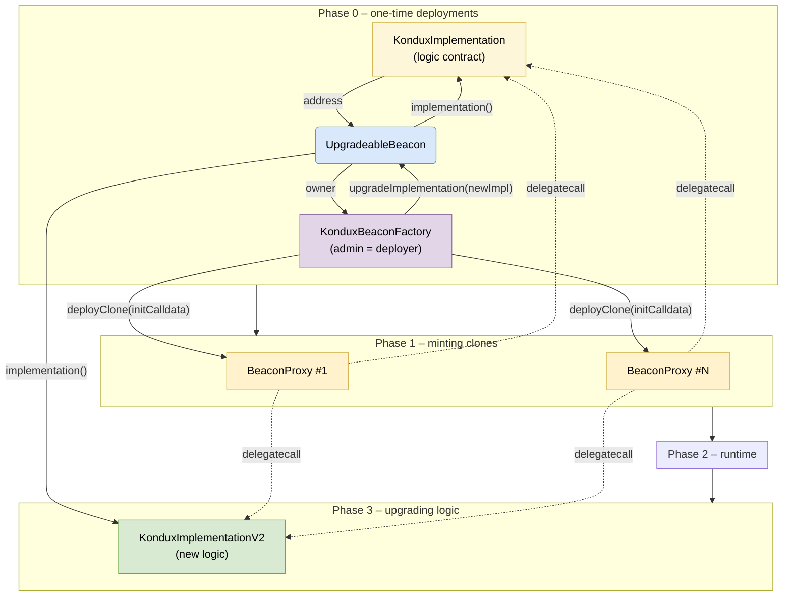

# KonduxImplementation (kNFT) Contract

> **Current System**: This document describes the beacon-based upgradeable NFT implementation. The current mainnet deployment uses **ERC721C** compliance with the Limit Break Transfer Validator for marketplace royalty enforcement.
>
> **Related Documentation**:
> - [kondux-royalty-model.md](../kondux-royalty-model.md) - Royalty configuration and enforcement
> - [KonduxBatchMinter.md](./KonduxBatchMinter.md) - Batch minting with EIP-712 signatures
> - [nft_dna.md](./nft_dna.md) - DNA system for trait encoding
>
> **Legacy Reference**: See `kNFT-legacy.md` and `kNFT_Factory-legacy.md` for the previous KNDX-based royalty system documentation.

---

## Table of Contents

- [Executive Summary of **KonduxImplementation** (kNFT) Contract](#executivesummary-of-konduximplementation-knft-contract)
  - [Table of Contents](#table-of-contents)
  - [Introduction](#introduction)
  - [Why a Clone‑Model?](#why-a-clonemodel)
  - [Kondux NFT ‑ Upgradeable Architecture](#konduxnft--upgradeable-architecture)
    - [High‑level overview](#highlevel-overview)
    - [Typical flows](#typical-flows)
  - [Gas‑cost snapshot (Hardhat, **0.209 gwei**, Solidity 0.8.30, optimiser ON / runs 800)](#gascost-snapshot-hardhat-0209gwei-solidity0830-optimiseronruns800)
    - [Observations](#observations)
    - [Key take‑aways](#key-takeaways)
  - [Quick‑Start Guide — Beacon‑based kNFT Collections](#quickstart-guide-beaconbased-knft-collections)
    - [1 · Deploy a new collection](#1deploy-a-new-collection)
    - [2 · Obtaining admin control](#2obtaining-admin-control)
    - [3 · Post‑clone checklist](#3postclone-checklist)
    - [4 · Factory‑level controls](#4--factorylevel-controls)
  - [Leasing / Rental Flow (EIP‑4907)](#leasing--rental-flow-eip4907)
  - [Handy **Getter / View** Functions for Front‑End Integrations](#handy-getter--view-functions-for-frontend-integrations)
    - [Example: Display royalty info for a token](#example-display-royalty-info-for-a-token)
    - [Responsive UI Pattern](#responsive-ui-pattern)
  - [Real‑World Use‑Cases](#realworld-usecases)

---

## Introduction

The **KonduxImplementation** contract is a feature‑rich, upgrade‑ready ERC‑721 collection template designed to be **cloned once per collection** via EIP‑1167 minimal proxies and managed from the **Kondux Contract Factory**. It provides a comprehensive set of tools for NFT creators, including:

| Capability group                          | Main functions / storage                                                                                                                                                              | Purpose                                                                                                            |
| ----------------------------------------- | ------------------------------------------------------------------------------------------------------------------------------------------------------------------------------------- | ------------------------------------------------------------------------------------------------------------------ |
| **Upgradeable ERC‑721 core**              | `ERC721Upgradeable`, `ERC721EnumerableUpgradeable`, `ERC721BurnableUpgradeable`, `setBaseURI`, `tokenURI`                                                                             | Standard NFT minting, enumeration, burning, and metadata management with future‑proof upgrades.                    |
| **Role‑based access control**             | Admin, `MINTER_ROLE`, `DNA_MODIFIER_ROLE`; `setRole`                                                                                                                                  | Fine‑grained, on‑chain permissioning for minting, DNA editing, and administration.                                 |
| **Per‑token DNA system**                  | `safeMint`, `setDna`, `batchSetDna`, `readGen`, `writeGen`                                                                                                                            | 256‑bit immutable/mutable DNA enabling on‑chain genetics, game stats, or trait control without off‑chain look‑ups. |
| **Royalty & fee engine**                  | ETH‑denominated per‑token royalty (`royaltyETHWei`) auto‑converted to KNDX using Uni‑V2 pool reserves; configurable manufacturer/partner/creator splits; multiple exemption switches. |                                                                                                                    |
| **Marketplace‑level royalty enforcement** | `_enforceRoyalty` hook in `_update` blocks transfers when royalties are unpaid, guaranteeing creator & treasury revenues without relying on off‑chain marketplaces.                   |                                                                                                                    |
| **Toggle‑driven feature flags**           | `royaltyEnforcementEnabled`, `founderPassExemptEnabled`, `mintedOwnerExemptEnabled`, `treasuryFeeEnabled`, `eip4907Enabled`, `freeMinting` allow collections to evolve post‑launch.   |                                                                                                                    |
| **Leasing (EIP‑4907)**                    | `setUser`, `userOf`, `userExpires`, `eip4907Enabled`                                                                                                                                  | Time‑boxed assignment of a “user” distinct from owner, enabling rentals, subscriptions, and delegation.            |
| **Treasury & partner routing**            | `setAddresses`, `setGlobalRoyaltyDefaults`, `adminSetTokenRoyalties`, `setPartnerWallet`                                                                                               | Route liquidity & royalty flows to Kondux treasury, partners, founders, or creators.                               |
| **Emergency administration**              | `emergencyWithdrawToken`, `emergencyWithdrawNFT`                                                                                                                                      | Safety valves for stuck funds/assets.                                                                              |
| **On‑chain price oracle**                 | `getKndxForEth` + `_getReserves`                                                                                                                                                      | Instant ETH→KNDX conversion based on live Uni‑V2 pool—used for pricing royalties and can be repurposed for mints.  |

---

## Why a Clone‑Model?

Kondux deploys the **implementation once**, then creates new collections with **EIP‑1167 minimal proxies** (“clones”).

| Benefit                            | Impact                                                                                                                                                                                                    |
| ---------------------------------- | --------------------------------------------------------------------------------------------------------------------------------------------------------------------------------------------------------- |
| **\~10× cheaper deployment gas**   | Clones store only a 45‑byte pointer to the implementation, ideal for frequent collection launches.                                                                                                        |
| **Uniform, battle‑tested logic**   | All collections inherit identical audited code, reducing attack surface.                                                                                                                                  |
| **Factory orchestration**          | The **Kondux Contract Factory** mints a new proxy, then immediately calls `initialize`—guaranteeing every collection is properly parameterised before going live.                                         |
| **Upgradeable & hot‑fix friendly** | Should a critical bug be found, a patched implementation can be rolled out and new collections can point to the new logic while existing ones remain unaffected (or can be migrated via Factory tooling). |
| **Predictable byte‑code**          | Facilitates deterministic addresses (CREATE2) and easy integration with front ends & sub‑graphs.                                                                                                          |

The **KonduxImplementation** obeys Factory conventions:

1. **Constructor is disabled** (`_disableInitializers`) preventing accidental direct deployments.
2. **All state is set in `initialize`**, matching the Factory’s post‑clone “init‑then‑config” pipeline.
3. **Storage gaps** (`uint256[50] private __gap`) leave room for future upgrades without memory collisions.

---

## Kondux NFT ‑ Upgradeable Architecture
  The **KonduxImplementation** contract is designed to be deployed once and then cloned for each new collection, leveraging the **Beacon Proxy** pattern for efficient upgrades and management. This architecture allows Kondux to maintain a single logic contract while enabling multiple collections to share the same codebase, ensuring consistency and ease of upgrades.

### High‑level overview



**Legend**

| Symbol                 | Description                                                                                                                                                                                            |
| ---------------------- | ------------------------------------------------------------------------------------------------------------------------------------------------------------------------------------------------------ |
| `KonduxImplementation` | Initial logic contract (never initialised, ***immutable***).                                                                                                                                           |
| `UpgradeableBeacon`    | Stores a single implementation address; every `BeaconProxy` delegates to it.                                                                                                                           |
| `KonduxBeaconFactory`  | Admin‑controlled contract that <br>• deploys new `BeaconProxy` clones (optionally gated by `CLONE_DEPLOYER_ROLE`) <br>• upgrades the beacon, thereby upgrading all existing clones in one transaction. |
| `BeaconProxy`          | Lightweight proxy whose implementation is looked‑up in the beacon on **each** call.                                                                                                                    |

### Typical flows

| Scenario                           | Steps                                                                                                                                                                                                                                                       |
| ---------------------------------- | ----------------------------------------------------------------------------------------------------------------------------------------------------------------------------------------------------------------------------------------------------------- |
| **Deploy first collection**        | 1️⃣ Deploy `KonduxImplementation`.<br>2️⃣ Deploy `KonduxBeaconFactory`, feeding it the impl address – the factory internally deploys an `UpgradeableBeacon`.<br>3️⃣ `factory.deployClone(initCalldata)` → emits `CloneDeployed` → first collection is live. |
| **Launch more collections**        | Call `deployClone()` again with different `initialize` parameters (name, symbol, supply, etc.).                                                                                                                                                             |
| **Upgrade all collections**        | 1️⃣ Deploy **new** logic contract `KonduxImplementationV2` (or V3…).<br>2️⃣ `factory.upgradeImplementation(newImpl)` – beacon now points to V2.<br>3️⃣ Every existing and future `BeaconProxy` instantly runs V2 code **without** touching its storage.     |
| **Restrict who can create clones** | `factory.setPublicDeployment(false)` → only addresses holding `CLONE_DEPLOYER_ROLE` may call `deployClone()`.                                                                                                                                               |
| **Emergency disable upgrade‑path** | Transfer beacon‑ownership to a burn address (optional governance decision).                                                                                                                                                                                 |

---

## Gas‑cost snapshot (Hardhat, **0.209 gwei**, Solidity 0.8.30, optimiser ON / runs 800)

| Contract / Method (selected)           | **Avg gas** | **USD (≈)** |
| -------------------------------------- | ----------: | ----------: |
| **KonduxImplementation**               |             |             |
| `initialize(..)`                       | **357 341** |      \$0.26 |
| `safeMint()`                           |     208 039 |      \$0.15 |
| `writeGen()`                           |      52 313 |      \$0.04 |
| `safeTransferFrom()`<br>(royalty path) |     126 808 |      \$0.09 |
| **KonduxBeaconFactory**                |             |             |
| `deployClone(bytes)`                   |     259 804 |      \$0.19 |
| `upgradeImplementation()`              |      39 375 |      \$0.03 |
| `setPublicDeployment()`                |      25 112 |      \$0.02 |
| **Access‑control helpers**             |             |             |
| `grantRole()` (factory)                |      51 434 |      \$0.04 |
| `grantRole()` (implementation)         |      59 270 |      \$0.04 |

*Numbers are the arithmetic means from the test run you provided;
gas‑to‑USD uses the same price assumptions as the Hardhat report.*

### Observations

* **Clone deployment is cheap** (\~260 k gas) because the heavy
  `KonduxImplementation` byte‑code is **not** redeployed – only a 55‑byte
  `BeaconProxy` plus initialisation.
* **Upgrading** *all* collections costs **< 40 k gas** – a single
  `beacon.upgradeTo()` call.
* The most expensive runtime path is `safeMint` (≈ 0.15 USD at the quoted gas
  price); typical user interactions like transfers or DNA edits remain well
  below 0.10 USD.

### Key take‑aways

* **Beacon pattern** gives *O(1)* upgrades – one transaction, any number of
  collections.
* Gas profile is dominated by individual per‑NFT operations, **not** by the
  upgrade machinery.
* Access‑control toggles (`setPublicDeployment`, role grants, etc.) are very
  inexpensive, enabling flexible permission management without economic pain.


---
## Quick‑Start Guide — Beacon‑based kNFT Collections

> **Prerequisites**
>
> * You already deployed **KonduxBeaconFactory** (you are its `DEFAULT_ADMIN_ROLE`).
> * You know the addresses of **WETH**, **KNDX**, **Founders Pass**, **Treasury**, and your **Uniswap V2 pair**.
> * You are working in Ethers v6 (pseudo‑JS below).

---

### 1 · Deploy a new collection

```js
import { ethers } from "ethers";

/**
 * Deploy a clone through the KonduxBeaconFactory and return its address.
 *
 * @param factory   Deployed KonduxBeaconFactory contract
 * @param initArgs  Plain argument list for initialize(...)
 * @param signer    Signer that calls the factory
 */
async function deployCloneThroughFactory(factory: any, initArgs: any, signer: any) {
  /* ------------------------------------------------------------- */
  /* 1. encode the initialise() calldata                           */
  /* ------------------------------------------------------------- */
  const initIface = new ethers.Interface([
    "function initialize(string,string,address,address,address,address,address,uint256)"
  ]);

  // If the caller passed an *empty* array, skip initialization
  const initData = (initArgs.length === 0)
    ? "0x"
    : initIface.encodeFunctionData("initialize", initArgs);


  /* ------------------------------------------------------------- */
  /* 2. send the transaction                                       */
  /* ------------------------------------------------------------- */
  const tx   = await factory.connect(signer).deployClone(initData);
  const rcpt = await tx.wait();

  /* ------------------------------------------------------------- */
  /* 3a. fast path – parse logs in the receipt                     */
  /* ------------------------------------------------------------- */
  for (const log of rcpt.logs) {
    try {
      const parsed = factory.interface.parseLog(log);
      if (parsed.name === "CloneDeployed") return parsed.args.proxy;
    } catch { /* not emitted by the factory – ignore */ }
  }

  /* ------------------------------------------------------------- */
  /* 3b. fallback – query events from chain                        */
  /* ------------------------------------------------------------- */
  const evt = await factory.queryFilter(
    factory.filters.CloneDeployed(null, signer.address),
    rcpt.blockNumber,
    rcpt.blockNumber
  );

  if (evt.length > 0) return evt[0].args.proxy;

  throw new Error("Clone address not found; neither logs nor queryFilter returned a match");
}

  

    /* ---- deploy the first *uninitialised* clone via the factory ---- */
    const cloneAddr = await deployCloneThroughFactory(factory, [], deployer); // <- [] !!
    console.log("Kondux clone address:", cloneAddr);

    const kondux = await ethers.getContractAt("KonduxImplementation", cloneAddr);

    /* ---- now initialise from an EOA that should become admin -------- */
    await kondux.connect(deployer).initialize(
      "Collection Name", // Collection name
      "SYMBOL", // Collection symbol
      uniswapV2Pair, // ETH-KNDX Uniswap V2 pair address for royalties
      WETH, // WETH address for royalties
      KNDX, // KNDX ERC 20 token for royalties
      FOUNDERSPASS_ADDRESS, // Founders Pass NFT Collection address for exemptions
      konduxTreasury, // Kondux Treasury address for payouts
      0                // maxSupply – set to 0 for unlimited supply
    );

    console.log("Kondux implementation initialized");    
```

*Under the hood* the factory:

1. Deploys a **BeaconProxy** (55 bytes) pointing at the shared beacon.
2. Executes `initialize(..)` *inside the proxy* – the proxy address therefore
   becomes the collection’s `DEFAULT_ADMIN_ROLE`.
3. Emits **`CloneDeployed(proxy, creator)`**.

---

### 2 · Obtaining admin control

If you need **EOA control** instead of “proxy‑is‑admin”, deploy **without**
initialisation (`deployClone("0x")`), then immediately call
`initialize(..)` from your wallet.
That first external call makes **you** the admin and lets you grant / revoke
roles:

```js
await collection.initialize(...same args...);          // you are admin
await collection.grantRole(await collection.MINTER_ROLE(), bot1);
```

---

### 3 · Post‑clone checklist

| Task                          | Typical reason                              | Function (admin‑only)                       |
| ----------------------------- | ------------------------------------------- | ------------------------------------------- |
| Set metadata base URI         | After IPFS / Arweave upload                 | `setBaseURI("ipfs://CID/")`                 |
| Enable / disable free minting | Open mint vs. gated                         | `setFreeMinting(true / false)`              |
| Add / remove minters          | Delegate bots or launchpad wallets          | `setRole(MINTER_ROLE, addr, true/false)`    |
| Add DNA editors               | Artist pipeline                             | `setRole(DNA_MODIFIER_ROLE, addr, true)`    |
| Per‑token royalty (ETH)       | Adjust beyond the default 0.001 ETH         | `setTokenRoyaltyEth(id, 1 ether / 1000)`    |
| Global royalty defaults       | New partner/manufacturer deal               | `setGlobalRoyaltyDefaults(cWei, mWei, pWei)`|
| Switch treasury fee on/off    | Promo period with zero platform fee         | `setTreasuryFeeEnabled(false)`              |
| Toggle royalty enforcement    | Testing on non‑royalty marketplaces         | `setRoyaltyEnforcement(false)`              |
| Update partner wallet         | Redirect partner share to new multisig      | `setPartnerWallet(newAddr)`                 |
| Update external addresses     | Treasury / token migration                  | `setAddresses(pair, weth, kndx, fp, treas)` |

---

### 4 · Factory‑level controls

| Action                                     | Function                               |
| ------------------------------------------ | -------------------------------------- |
| Disable public cloning                     | `setPublicDeployment(false)`           |
| Allow specific deployers (`user`) to clone | `grantRole(CLONE_DEPLOYER_ROLE, user)` |
| Upgrade **all** collections to new logic   | `upgradeImplementation(newImpl)`       |

> Upgrading is a single 40 k gas transaction – all past and future proxies
> instantly start executing the new implementation while keeping their own
> storage and state intact.

---

## Leasing / Rental Flow (EIP‑4907)

**Concept**: Ownership (transferable) vs *User* (time‑limited licence).
The owner or an approved operator may call:

```solidity
setUser(tokenId, renter, uint64(expiryTimestamp));
```

* Until `expiryTimestamp`, `userOf(tokenId)` returns the renter’s address.
* Marketplaces supporting 4907 can display “rented” status, preventing unauthorized sales.
* On transfer, `_update` **clears user data automatically**, avoiding dangling leases.

---

## Handy **Getter / View** Functions for Front‑End Integrations

A Kondux kNFT proxy exposes a rich set of inexpensive **`view`** calls that let dApps, indexers and wallets surface collection‑specific UX without custom sub‑graphs.  Below are the ones most teams ask for.

| What you need to show in the UI                 | Call / Variable                                                                                  | Notes                                                                              |
| ----------------------------------------------- | ------------------------------------------------------------------------------------------------ | ---------------------------------------------------------------------------------- |
| **Creator (original minter) royalty recipient** | `royaltyOwnerOf(tokenId) → address`                                                              | Set once on `safeMint`; can later be reassigned by that address or an admin.       |
| **Fixed royalty amount (in ETH wei)**           | `royaltyETHWei(tokenId) → uint256`                                                               | Always denominated in wei; front end can  ➜  `getKndxForEth` to preview KNDX owed. |
| **Instant ETH→KNDX quote**                      | `getKndxForEth(ethWei) → uint256`                                                                | Reads live Uniswap‑V2 reserves—no oracle needed.                                   |
| **DNA / trait blob (256 bits)**                 | `getDna(tokenId) → uint256`<br>`readGen(tokenId, start, end) → int256`                           | Use `readGen` to pull specific byte ranges (e.g. gene 5‑7).                        |
| **Leasing status (EIP‑4907)**                   | `userOf(tokenId) → address`<br>`userExpires(tokenId) → uint256`                                  | Returns `0x0` if rental expired or feature disabled.                               |
| **Whether a feature is toggled on**             | Public booleans:<br>`royaltyEnforcementEnabled`<br>`freeMinting`<br>`eip4907Enabled`, etc.       | Surfaces collection governance decisions in real time.                             |
| **Royalty breakdown (wei)**                     | `getTokenRoyalty(tokenId) → (creator, manufacturer, partner)`<br>`default{Creator,Manufacturer,Partner}RoyaltyWei` | Show current token amounts and fall back to collection defaults.                    |
| **Partner wallet (if set)**                     | `partnerWallet → address`                                                                        | Falls back to `royaltyOwnerOf(tokenId)` on‑chain if `0x0`.                         |
| **Current supply stats**                        | `totalSupply()` (from ERC‑721 Enumerable)<br>`maxSupply`                                         | Useful for mint progress bars.                                                     |
| **Interface support probe**                     | `supportsInterface(0xad092b5c)` → leasing?<br>`supportsInterface(0x49064906)` → metadata update? | Allows dynamic feature detection across clones.                                    |
| **Base metadata URI**                           | `baseURI`                                                                                        | Good for IPFS pin‑checks or off‑chain cache invalidation.                          |

### Example: Display royalty info for a token

```js
const owner      = await kNFT.royaltyOwnerOf(tokenId);
const ethRoyalty = await kNFT.royaltyETHWei(tokenId);
const kndxDue    = await kNFT.getKndxForEth(ethRoyalty);

console.log(`On next transfer ${formatWei(ethRoyalty)} ETH ≈ ${formatUnits(kndxDue, 18)} KNDX
will be split between creator / partner / treasury.`);
```

### Responsive UI Pattern

1. **Detect capabilities** at load‑time with `supportsInterface`.
2. **Subscribe to EIP‑4906 `MetadataUpdate`** events to auto‑refresh images or traits.
3. **Cache‑layer**: because all getters are pure on‑chain reads, you can safely memoize responses until a relevant event fires.

By leaning on these built‑in getters, integrators avoid custom Graph schemas and deliver feature‑aware experiences that stay in sync with every Kondux collection, present and future.

---

## Real‑World Use‑Cases

| Scenario                          | How it works in kNFT                                                                                 | Business value                                                 |
| --------------------------------- | ---------------------------------------------------------------------------------------------------- | -------------------------------------------------------------- |
| **In‑game item rentals**          | Game dev mints swords; players rent using `setUser`; smart contract enforces expiry.                 | Earn yield on idle assets; low‑risk trial for new players.     |
| **Season‑pass memberships**       | Music venue sells kNFT; holders lease their access to friends for specific concerts.                 | Maximises utilisation without permanent transfer.              |
| **Digital twins for IoT devices** | EV manufacturer mints kNFT per vehicle; rental agencies call `setUser` for each ride‑share customer. | On‑chain audit trail of vehicle usage, easy revenue splitting. |
| **IP licensing / brand collabs**  | Fashion brand grants 1‑month usage rights of a design via `setUser`; expiry auto‑revokes.            | Rapid, automated micro‑licensing without lawyers.              |

*Opt‑out*: If a collection never needs rentals, an admin can permanently disable 4907 by `setEip4907Enabled(false)` to save gas on transfers.


