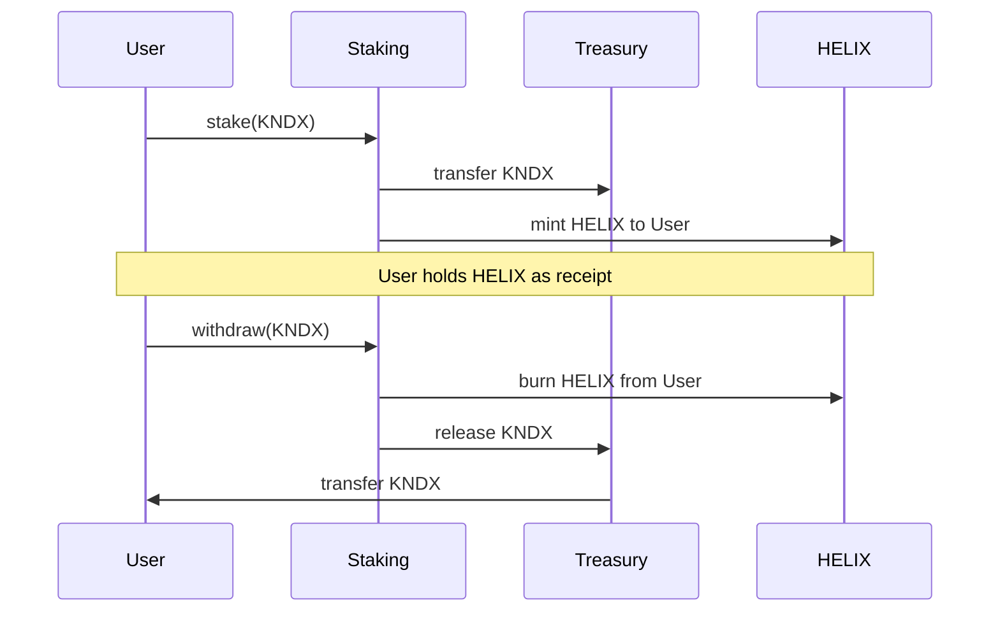

# Helix Token (HLX)

## Overview

Helix Token (HLX) is a controlled ERC20 token that serves as a **staking receipt** in the Kondux ecosystem. When users stake KNDX tokens, they receive HELIX at a 10,000:1 ratio, representing their staked position.

**Key Properties:**
- Transfer-restricted by default (whitelisted contracts only)
- Role-based minting and burning
- Required for withdrawing staked KNDX

---

## Role in Staking



**Exchange Rate:** 10,000 HELIX per 1 KNDX staked

To withdraw staked KNDX, users must burn the equivalent HELIX tokens. This mechanism:
- Prevents unauthorized withdrawals
- Creates a verifiable on-chain staking receipt
- Enables potential secondary market for staking positions

---

## Transfer Restrictions

HELIX implements controlled transfers to maintain staking integrity:

| Transfer Type | Default State | Notes |
|---------------|---------------|-------|
| User → User | **Blocked** | Prevents receipt token trading by default |
| Whitelisted Contract → User | **Allowed** | Staking contract can mint/burn |
| User → Whitelisted Contract | **Allowed** | Required for withdrawal |
| Unrestricted Mode | **Disabled** | Admin can enable for special cases |

### Whitelist Management

Only whitelisted contracts can facilitate HELIX transfers:

```solidity
// Admin adds staking contract to whitelist
helixToken.setWhitelisted(stakingContractAddress, true);

// Admin removes from whitelist
helixToken.setWhitelisted(oldContract, false);
```

### Unrestricted Transfers

Admins can enable unrestricted transfers (use with caution):

```solidity
// Enable free transfers between all addresses
helixToken.setUnrestrictedTransfers(true);
```

---

## Roles

| Role | Permissions | Typical Holder |
|------|-------------|----------------|
| **Admin** | Manage whitelist, toggle restrictions | Multisig/DAO |
| **Minter** | Create new tokens | Staking contract |
| **Burner** | Destroy tokens | Staking contract |

### Role Assignment

```solidity
// Grant minter role to staking contract
helixToken.grantRole(MINTER_ROLE, stakingContract);

// Grant burner role to staking contract
helixToken.grantRole(BURNER_ROLE, stakingContract);

// Revoke role
helixToken.revokeRole(MINTER_ROLE, oldContract);
```

---

## Security Considerations

1. **Transfer Restrictions**: Prevent unauthorized trading of staking receipts
2. **Role Separation**: Minting/burning only by authorized contracts
3. **Admin Controls**: Emergency toggles for system maintenance

### Best Practices

- Keep unrestricted transfers **disabled** in production
- Whitelist only verified, audited contracts
- Use multisig for admin role
- Audit whitelist periodically

---

## Related Documentation

- [staking-system.md](./staking-system.md) - Complete staking guide with HELIX mechanics
- [../kondux-royalty-model.md](../kondux-royalty-model.md) - KNDX token usage in royalties
