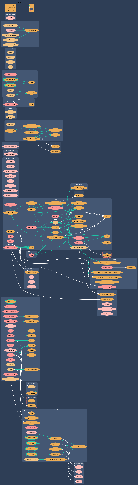

# Kondux DAO

Kondux is a decentralized system for minting NFTs in which the owner of the NFT can use the NFT on Omniverse. 

The NFT is stored in the [Kondux_NFT contract](../../contracts/Kondux_NFT.sol). IT's a ERC721 token, plus some extra capabilities:
    
- The NFT attributes are stored in the [DNA](./nft_dna.md), a uint256 variable in the Kondux_NFT contract. 
- The NFT have a [royalty reward information](./royalty_reward.md) stored in the contract. The reward is paid to the creator or someone that holds the copyright of the NFT.

The [Minter Contract](../../contracts/Minter.sol) is used to mint NFTs. This contract calls the Kondux_NFT contract to mint the NFT. The Minter Contract has a special function that allows owners of Grey Alien NFT or those who is whitelisted to mint new Kondux NFTs with special conditions (discounts, vip pass, etc).

The [Authority Contract](../../contracts/Authority.sol) is used to manage the Kondux_NFT contract. This contract has functions that are used to control governance on all Kondux contracts. It has the following roles:
- <ins>Governor</ins>: the account that can use administrative functions on the Kondux contracts (like "Ownable" pattern).
- <ins>Vault</ins>: the account that will receive funds sent to the Kondux contracts.
- <ins>Policy</ins>: account that can set business rules on the Kondux contracts.
- <ins>Guardian</ins>: account responsible for starting governance rituals.

## Class Diagram

