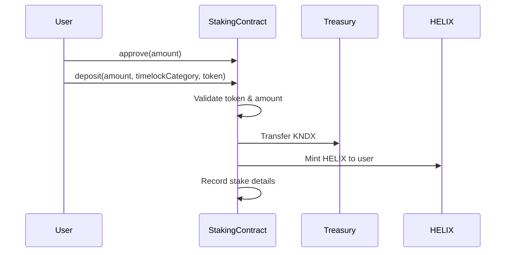

# Kondux Staking System

## Overview

The Kondux Staking System is a DeFi platform enabling users to stake KNDX tokens and earn rewards in HELIX tokens. The system features flexible locking periods, compound interest, NFT-based reward boosts, and a robust governance structure.

---

## Table of Contents

- [Key Features](#key-features)
- [Token Economics](#token-economics)
- [Staking Mechanics](#staking-mechanics)
- [NFT Boost System](#nft-boost-system)
- [Locking Periods](#locking-periods)
- [Developer API Reference](#developer-api-reference)
- [Technical Architecture](#technical-architecture)
- [APR Calculation Examples](#apr-calculation-examples)
- [Security Considerations](#security-considerations)

---

## Key Features

| Feature | Description |
|---------|-------------|
| **Token Staking** | Stake KNDX ERC20 tokens to earn rewards |
| **HELIX Rewards** | Receive 10,000 HELIX per 1 KNDX staked |
| **Flexible Locking** | Choose from 30, 90, 180, or 365-day lock periods |
| **NFT Boosts** | Founder's Pass and kNFT holdings increase rewards |
| **Compounding** | Compound rewards every 24 hours for exponential growth |
| **Early Unstaking** | Available with regressive penalty based on remaining time |

---

## Token Economics

### Core Parameters

| Parameter | Value |
|-----------|-------|
| Base APR | 25% annually |
| Rewards per Hour | ~0.00285% |
| Minimum Stake | 10,000,000 KNDX wei (0.00000001 KNDX) |
| HELIX Exchange Rate | 10,000 HELIX per 1 KNDX |
| Compound Frequency | Every 24 hours |
| Withdrawal Fee | 1% |

### HELIX Token Mechanism

When staking KNDX:
1. KNDX tokens are transferred to the Treasury contract
2. HELIX tokens are minted to your wallet at the 10,000:1 ratio
3. To withdraw KNDX, you must burn the equivalent HELIX tokens

---

## Staking Mechanics

### Deposit Process



### Reward Calculation

Rewards are calculated using:

```
Adjusted APR = Base APR x (1 + Total Boost Percentage / 100)
Rewards = Staked Amount x (Adjusted APR / 365) x Days Staked
```

Where **Total Boost Percentage** = Founder's NFT Boost + kNFT Boosts + Locking Period Boost

### Withdrawal Process

**Standard Withdrawal** (after lock period):
1. 1% withdrawal fee applied
2. HELIX tokens burned at 10,000:1 ratio
3. Net KNDX transferred to user

**Early Unstaking** (before lock period ends):
1. All boosts forfeited
2. Regressive penalty applied: `Penalty = 10% x (Time Remaining / Total Lock Duration)`
3. Minimum penalty: 1% if calculated penalty is lower
4. 1% withdrawal fee + penalty applied

---

## NFT Boost System

### Founder's Pass Boost

| Condition | Boost |
|-----------|-------|
| Hold 1+ Founder's Pass NFT | **+10%** reward boost |

### kNFT Boosts

kNFTs provide boosts based on their "bonus gene" in the DNA:

| kNFT Bonus Gene | Boost Range |
|-----------------|-------------|
| Per kNFT | 1% - 5% |
| Maximum kNFTs Counted | 5 (highest boosts selected) |
| Maximum kNFT Boost | Up to 25% (5 x 5%) |

The staking contract:
1. Queries all kNFTs owned by the user
2. Reads the bonus gene from each kNFT's DNA
3. Selects the top 5 highest boost values
4. Sums them for the total kNFT boost

---

## Locking Periods

| Duration | Boost | Use Case |
|----------|-------|----------|
| 30 days | 0% | Short-term, flexible staking |
| 90 days | +1% | Moderate commitment |
| 180 days | +3% | Medium-term holders |
| 365 days | +9% | Long-term believers |

**Testing Periods** (testnet only):
- 2 minutes: 0% boost
- 24 hours: 50% boost
- 48 hours: 100% boost

---

## Developer API Reference

### Core Functions

#### Depositing

```javascript
// Approve first
await kndxToken.approve(stakingAddress, amount);

// Deposit with timelock
// timelockCategory: 0=30d, 1=90d, 2=180d, 3=365d
const tx = await staking.deposit(amount, timelockCategory, tokenAddress);
await tx.wait();
// Emits: Stake(id, sender, amount)
```

#### Claiming Rewards

```javascript
// Claim rewards (only after timelock expires)
const tx = await staking.claimRewards(stakeId);
await tx.wait();
// Emits: Reward(sender, amount)
```

#### Withdrawing

```javascript
// Standard withdrawal (after timelock)
const tx = await staking.withdraw(amount, stakeId);
await tx.wait();
// Emits: Withdraw(sender, amount)

// Early unstaking (penalty applies)
const tx = await staking.earlyUnstake(amount, stakeId);
await tx.wait();
```

#### Compounding

```javascript
// Restake rewards into principal
const tx = await staking.stakeRewards(stakeId);
await tx.wait();
// Emits: Compound(sender, amount)
```

### View Functions

```javascript
// Calculate pending rewards
const rewards = await staking.calculateRewards(userAddress);

// Get staked amount
const staked = await staking.getStakedAmount(userAddress);

// Get all stake IDs for user
const stakeIds = await staking.getDepositIds(userAddress);

// Get specific stake info
const info = await staking.getDepositInfo(userAddress, stakeId);

// Get current APR
const apr = await staking.getRewardsPerHour();

// Get boost values
const foundersBoost = await staking.getFoundersRewardBoost();
const kNFTBoost = await staking.getkNFTRewardBoost();

// Get minimum stake
const minStake = await staking.getMinStake();

// Get user's timelock info
const category = await staking.getTimelockCategory(userAddress);
const unlockTime = await staking.getTimelock(userAddress);
```

---

## Technical Architecture

### Data Structures

```solidity
struct Staker {
    uint256 deposited;        // Amount of tokens staked
    uint256 timeOfLastUpdate; // Last reward calculation timestamp
    uint256 unclaimedRewards; // Accumulated unclaimed rewards
    uint256 lastDepositTime;  // Initial deposit timestamp
    uint256 timelock;         // Timelock expiration timestamp
    uint8 timelockCategory;   // Lock period category (0-3)
    uint256 ratioERC20;       // HELIX/KNDX conversion ratio
    address staker;           // User address
    address token;            // Staked token address
}
```

### Key Mappings

```solidity
mapping(uint256 => Staker) public userDeposits;           // Deposit ID -> Stake info
mapping(address => uint256[]) public userDepositsIds;     // User -> Deposit IDs
mapping(address => uint256) public aprERC20;              // Token -> APR
mapping(address => uint256) public totalStaked;           // Token -> Total staked
mapping(address => uint256) public foundersRewardBoostERC20; // Token -> Founder boost
```

### External Contracts

| Contract | Purpose |
|----------|---------|
| `IERC20 helixERC20` | HELIX token for reward representation |
| `IERC20 konduxERC20` | KNDX token for staking |
| `IERC721 konduxERC721Founders` | Founder's Pass NFT |
| `IKondux konduxERC721kNFT` | kNFT contract for boost calculation |
| `ITreasury treasury` | Holds staked tokens, distributes rewards |

### Access Control

The contract uses an Authority pattern for governance:

| Role | Permissions |
|------|-------------|
| **Governor** | Set APR, fees, boosts, add tokens |
| **Vault** | Receives funds |
| **Policy** | Set business rules |
| **Guardian** | Governance rituals |

---

## APR Calculation Examples

All examples assume **10,000 KNDX** staked for **180 days**.

### Basic Scenarios

| Scenario | Boosts | Adjusted APR | 180-day APR | Rewards |
|----------|--------|--------------|-------------|---------|
| No boosts | None | 25% | 12.33% | 1,233 KNDX |
| Founder's NFT only | 10% | 27.5% | 13.56% | 1,356 KNDX |
| 180-day lock only | 3% | 25.75% | 12.70% | 1,270 KNDX |
| 1 kNFT (3%) | 3% | 25.75% | 12.70% | 1,270 KNDX |

### Combined Boost Scenarios

| Boosts | Total Boost | Adjusted APR | 180-day APR | Rewards |
|--------|-------------|--------------|-------------|---------|
| Founder + 180d lock | 13% | 28.25% | 13.92% | 1,392 KNDX |
| Founder + 1 kNFT + 180d | 16% | 29% | 14.27% | 1,427 KNDX |
| Founder + 3 kNFTs + 180d | 22% | 30.5% | 15.07% | 1,507 KNDX |
| Founder + 5 kNFTs + 180d | 28% | 32% | 15.75% | 1,575 KNDX |

### Early Unstaking Penalty Examples

| Scenario | Duration | Remaining | Penalty | Base APR | Net APR | Rewards |
|----------|----------|-----------|---------|----------|---------|---------|
| 180d lock, unstake at 120d | 120d | 60d | 3.33% | 8.22% | 4.89% | 489 KNDX |
| 365d lock, unstake at 240d | 240d | 125d | 3.42% | 16.44% | 13.02% | 1,302 KNDX |
| 90d lock, unstake at 45d | 45d | 45d | 5% | 3.08% | -1.92% | **Loss** |

---

## Security Considerations

### Reentrancy Protection

All state-changing functions use the `nonReentrant` modifier to prevent reentrancy attacks.

### Access Control

- Governor-only functions for parameter changes
- Ownership verification for all user operations
- External contract interactions use standard interfaces

### Input Validation

- Minimum stake amounts enforced
- Token authorization checks
- Balance and allowance verification
- Timelock category bounds checking

### Best Practices

1. **Before Staking**: Verify you have sufficient KNDX balance and have approved the staking contract
2. **Choosing Lock Period**: Select a period you're comfortable with to avoid early unstaking penalties
3. **Compounding Strategy**: Regular compounding maximizes returns through exponential growth
4. **NFT Holdings**: Acquire Founder's Pass and high-boost kNFTs for maximum rewards
5. **HELIX Management**: Ensure you retain HELIX tokens for withdrawal (don't transfer them away)

---

## Stay Connected

- **Website**: [Kondux.io](https://kondux.io)
- **Twitter**: [@Kondux_KNDX](https://x.com/Kondux_KNDX)
- **Discord**: [discord.gg/pvmgMjtG](https://discord.gg/pvmgMjtG)
- **Telegram**: [t.me/konduxcommunity](https://t.me/konduxcommunity)

*This documentation is for informational purposes only and does not constitute financial advice.*
