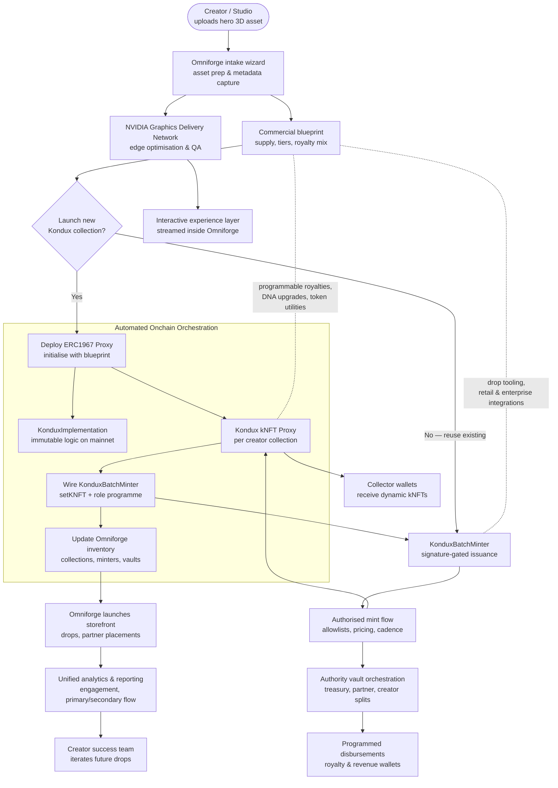

# Omniforge Deployment & Minting Flow

## Notes

- **Unified ingestion → commerce → delivery**: Omniforge packages creator assets, optimises them with NVIDIA GDN for real-time streaming, and aligns commercial terms before any onchain steps, ensuring the deployment mirrors the business blueprint.
- **Scalable Kondux architecture**: A single `KonduxImplementation` logic contract underpins every collection. When a creator needs a bespoke line, the platform spins up an ERC1967 proxy, initialises it with tier rules, and hands its address to `KonduxBatchMinter` via the new `setKNFT` hook.
- **Enterprise-grade drop controls**: `KonduxBatchMinter` orchestrates signature-gated mints (allowlists, partner allocations, timed releases) while enforcing economic guardrails—supply, pricing, DNA gating—defined in the Omniforge offering layer.
- **Automated finance and compliance**: Proceeds route through the `Authority` vault, executing royalty waterfalls and partner splits without manual intervention. Treasury events are logged in the Omniforge inventory ledger for audit, BI, and downstream payouts.
- **Actionable intelligence loop**: Every collection entry feeds omnichannel analytics so business development and creator success teams can optimise future drops, sponsorships, and live activations.
